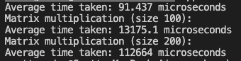

# C++ Benchmarking Tool

## Description
The C++ Benchmarking Tool is designed to showcase the power and efficiency of C++. It allows users to run a variety of computational tasks, measuring and reporting their average execution times to emphasize the performance characteristics of C++.

## Features
- **Fast Execution**: Utilizes C++'s raw power and speed.
- **Extensible**: Easily add new computational tasks to be benchmarked.
- **Modern C++ Techniques**: Makes use of `std::chrono` for high-resolution time measurements and lambda functions for flexibility.

## C++ Techniques Utilized
- `std::chrono` for time measurements
- Lambda functions for dynamic task execution
- `std::function` for storing callable entities
- STL algorithms like `std::generate` and `std::sort`

## Building and Running
1. Clone the repository:
   ```bash
   git clone [https://github.com/5c077-60rd0n/cpp-benchmarking-tool]
   cd cpp-benchmarking-tool
   ```
2. Build the tool:
   ```bash
   make
   ```
3. Run the benchmarking tool:
   ```bash
   ./CppBench
   ```

## Sample Output
```
Average time taken: 91.437 microseconds
Matrix multiplication (size 100):
Average time taken: 13175.1 microseconds
Matrix multiplication (size 200):
Average time taken: 112664 microseconds
```

